<div align="center">

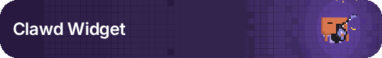

# Clawd Widget

**Clawd lives on your screen.** A pixel-art button where Clawd jams on guitar, watches your cursor, dozes off when you're away, cheers when Claude Code finishes a task, and hides a mini-game.

Browser extension · Desktop widget · `<clawd-button>` web component · OBS overlay

[](https://github.com/tHEtRICKsTER-N/Clawd-Widget/actions/workflows/ci.yml)

</div>

> An unofficial fan project. Clawd is the Claude Code mascot; this project isn't affiliated with or endorsed by Anthropic.

## What it does

Click it and Clawd plays one of 12 animations while every beat ripples through the energy grid. Between plays it lives a little: it follows your pointer, dangles when you drag it, squishes when you poke it, stretches, yawns and wanders, and naps if you leave it alone.

| | |
|:---:|:---:|
| 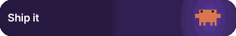 | 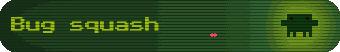 |
| **Ship It**: countdown, liftoff, a trail across the grid | **Bug Squash**: pounce! (Game Boy theme, CRT on) |
| 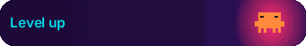 | 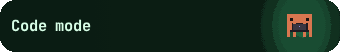 |
| **Level Up**: mushroom-style power-up | **Code Mode**: typing furiously |
| 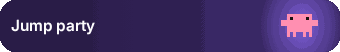 | 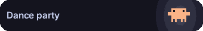 |
| **Jump Party**: a shockwave on every landing | **Dance Party** |
|  | 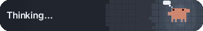 |
| **Hello Wave** | **Thinking**: loops while Claude Code works |
| 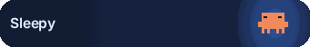 | 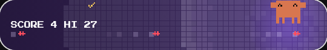 |
| **Sleepy** | **Bug Jump**: a runner game played on the button |
| 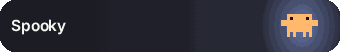 | 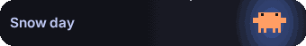 |
| **Spooky** 🎃 in October | **Snow Day** ❄️ in December |

<p align="center"><br><b>Party mode</b>: Auto-play on Non-stop with Shuffle colors, one animation after another in a new theme each time</p>

### Made for

- **Gamers:** Bug Jump, a certain famous cheat code, nine achievements (six of them unlock hats and shades for Clawd), chiptune sound effects synthesized in sync with the grid, and Game Boy, PICO-8 and Virtual Boy themes with a CRT filter.
- **Claude Code users:** with three [hooks](#recipe-clawd-follows-claude-code), Clawd thinks while Claude works, waves when it needs you, and throws a party when it's done.
- **Streamers:** an [OBS overlay](#obs-overlay-for-streamers) set up entirely from a URL, with a transparent background.
- **Game devs and web devs:** [`<clawd-button>`](packages/clawd-button/README.md) makes it your game's Play button in one tag, and the exporter turns any animation into a GIF, WebM or sprite sheet (all the GIFs on this page came from it).

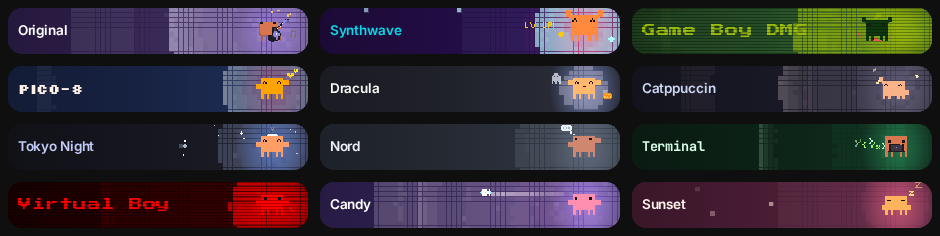

## Get it

**What's new:** see [CHANGELOG.md](CHANGELOG.md).

**Downloads:** every release on the [Releases page](https://github.com/tHEtRICKsTER-N/Clawd-Widget/releases) has the Windows installer and portable `.exe`, the browser extension as a zip (unzip it, then `chrome://extensions` → Developer mode → **Load unpacked**), and the `<clawd-button>` package. No Node.js needed.

**From source:**

| | where | how to run |
|---|---|---|
| **Web playground** | `src/` | `npm run dev` → http://localhost:5178 |
| **Browser extension** (Chrome, Edge, Brave, Arc) | `extension/` → `dist-extension/` | `npm run build:ext`, then `chrome://extensions` → Developer mode → **Load unpacked** → pick `dist-extension/` |
| **Desktop widget** (Windows; also builds for macOS/Linux) | `desktop/` → `release/` | `npm run desktop` to run, `npm run dist:desktop` to build `release/Clawd Widget Setup <version>.exe` (installer) and `release/Clawd Widget <version>.exe` (portable) |
| **`<clawd-button>` web component** (any web page, e.g. a game's Play button) | `src/wc/` → `packages/clawd-button/` | `npm run build:wc`, then open `packages/clawd-button/demo.html` from a local web server. See [its README](packages/clawd-button/README.md) |

Want to help? See [CONTRIBUTING.md](CONTRIBUTING.md). New animations, themes and hats are very welcome.

## Getting started

Requirements: **Node.js 20+** (built with Node 24). Python 3 with Pillow is only needed if you regenerate the icons (`npm run icons`).

**Quickest:** double-click **`setup.bat`** on Windows, or run `./setup.sh` on macOS/Linux. It checks for Node, installs dependencies and builds the extension and desktop pages. Or do it by hand:

```bash
npm install          # also downloads Electron (~100 MB) for the desktop widget
npm run dev          # web playground at http://localhost:5178
```

`node_modules/`, `dist*/` and `release/` are not included in the shared zip. Everything in them is regenerated by the commands in the table above.

## Features in detail

- **Click to play once**, then it rests in an idle pose (blinks, glances around). Choose **Loop** to keep it going after a click.
- **Idle antics:** every few minutes Clawd stretches, yawns, scratches its head, wanders across the button and back, sneezes, whistles a tune, looks around, or does a happy little hop. Left alone for five minutes, it nods off (Zzz) and wakes with a start when the pointer comes near. Turn it off with *Idle antics*.
- **Auto-play (off by default):** leave Clawd alone and it plays a random animation now and then: roughly every 30 s, 1, 2, 5, 10 or 30 minutes (the gap varies so it never feels mechanical), or **Non-stop**, back to back. It waits while you drag the widget, play Bug Jump, or Clawd is waiting on you, and pauses while the page or widget is hidden. Auto-plays don't count for achievements. It's in *Between plays*, and in the desktop right-click menu.
- **Shuffle colors (with auto-play):** every auto-play glides smoothly (1.5 s) into a random theme, so animations and colours get mixed and matched. Your own colours stay saved; turn it off and Clawd glides back to them. With Non-stop it's a party mode.
- **Achievements and a wardrobe:** nine goals pop a pixel toast when you reach them: first jam, a 10-poke combo, 100 clicks, every year-round animation, playing at 3 AM, a certain cheat code, frequent flying, waking Clawd up, and scoring 20 in Bug Jump. Six of them unlock something for Clawd to wear: a party hat, a propeller cap, a crown, deal-with-it shades, a nightcap or headphones. The item sits on its head in every pose, guitar solos included. Pick one under *Achievements → Wear*.
- **Bug Jump 🎮:** a tiny runner played right on the button. Bugs crawl in along the grid, leaving glowing cells behind them, and Clawd jumps over them. Catch the ✓s mid-jump for extra points. Click, <kbd>Space</kbd> or <kbd>↑</kbd> jumps, and <kbd>Esc</kbd> quits. The score takes the label's place and your high score is saved. It opens from 🎮 in the hover toolbar.
- **A secret:** click the widget, then type a certain famous cheat code. Gamers will know it. It only listens while the widget has focus, never to the page you're on.
- **Poke Clawd:** a click on Clawd itself gets a squish and a heart instead of a play (the rest of the button still plays). Poke fast for a combo ("x5!") with bigger pulses on every hit, and a little celebration every 10. Turn it off with *Poke Clawd*.
- **Eyes follow your cursor** while Clawd rests, in 8 directions, and look straight at you when the pointer is on it. After a few seconds of stillness it goes back to blinking and glancing around. On desktop it watches the mouse anywhere on screen. Turn it off with *Eyes follow cursor*.
- **Animations:** Guitar Jam (the original), Hello Wave, Jump Party, Code Mode, Dance Party, Sleepy, Thinking, Ship It (a countdown and a rocket that streaks across the button), Bug Squash (Clawd pounces on a bug), Level Up (a mushroom-style grow flicker and a fanfare of arrows), or **Random**, which picks a different one on every click.
- **Seasonal animations:** Spooky 🎃 (lightning, a jack-o'-lantern, bats and a ghost, all October) and Snow Day ❄️ (1 December to 7 January) join the picker, the menus and Random in their season. Out of season they're still there by id for the command line, the overlay and Export.
- **Customizable:** label text, font (Inter, Space Grotesk, JetBrains Mono, two pixel fonts, System, Serif, or any installed font), bold, and colors for the background, background glow, text, bot, energy cells, energy glow and particles. Includes 15 presets (7 classics plus Game Boy DMG, PICO-8, Virtual Boy, Synthwave, Dracula, Catppuccin, Tokyo Night and Nord), an optional CRT scanline overlay, and 4 sizes.
- **Export GIF, WebM or a sprite sheet:** any animation in your current look (colours, font, label, CRT, even what Clawd is wearing), at S/M/L/XL and 12–50 fps. *Seamless loop* exports just the looping part so it repeats without a jump. Frames are exact, since the engine is a function of time, and the export matches what you see on screen. It's in the *Export* card in the playground, the extension's options page and the desktop settings. WebM needs a Chromium browser.
- **Share codes:** your theme (colours and CRT) as one short string like `clawd:OiZfWDee____2HZP7-j_oHb48MNaAA`. Copy it from the Colors card, and paste someone else's there to use it.
- **Chiptune sound (off by default):** square-wave and noise blips made on the fly with Web Audio (no audio files), one for every pulse of the grid: strums pluck, power chords crunch, landings thump, twinkles blip. Turn it on in *Sound* (with a volume slider), from the speaker in the hover toolbar, or from the desktop right-click menu.
- **Reduced motion:** when your system asks for reduced motion, the grid flashes at most 3 times a second (a burst of rapid strums becomes one pulse) and less brightly, the tap flash is skipped, and Clawd's eyes change direction at most every 0.6 s. Nothing changes for everyone else.
- **Light at rest:** while Clawd is resting, the widget only draws when something changes (a blink, the pointer moving, an antic), about once a second instead of 60 times. Dozing runs at a relaxed 12 fps.
- **Floating widget:** drag it anywhere. Clawd dangles while you carry it and lands with a thud that shakes the grid (*Dangle when dragged*). It docks to the nearest corner and snaps to edges. The hover toolbar has play, random, Bug Jump, sound on/off, customize and hide.
- **Extension extras:** settings sync across your browsers (`chrome.storage.sync`) and update every open tab live. Hide it per site from the toolbar or popup. Shortcuts: `Alt+Shift+K` show/hide, `Alt+Shift+P` play random. The widget lives in a shadow root and its fonts are embedded, so page CSS and CSP can't break it.
- **Desktop extras:** frameless, transparent and always on top. Clicks pass through the transparent margin. Right-click or the tray icon for animation, size, sound, always-on-top, start with Windows, control from scripts, customize and quit.

## Code map

```
src/engine/            pure, time-driven animation engine (no DOM)
  grid.ts              11px cell energy field (fitted to the reference)
  pulses.ts            pulse types: rings, discs, horizontal scans, twinkles
  clawd.ts             front-facing pose builder (eyes/arms/legs/laptop)
  sprites.ts           traced guitar-playing frames
  animations/*.ts      one file per animation + registry, seasons, idle pose, random pick
  frame.ts             what a play shows at time t (loop seams, fade-out after a play)
  reactions.ts         live reactions (drag, drop, pokes, combo, celebration) as pure functions of time
  antics.ts            idle antics (stretch, yawn, scratch, wander), dozing off and waking up
  cosmetics.ts         things to wear, placed on each frame's head and eyes
src/core/
  renderer.ts          ClawdButton: framework-free canvas renderer (theme, font, play/loop/idle); naps between changes at rest
  sound.ts             ChipSound: Web Audio chiptune synth, one sound per pulse kind
  achievements.ts      stats, achievements and the tracker that saves them (debounced, merge-safe across tabs)
  game.ts              Bug Jump: the mini-game played on the button
  export.ts            GIF (gifenc) / WebM (WebCodecs VP9 + a small WebM writer) / PNG sprite-sheet export
  overlay.ts           named values ⇄ settings: the OBS overlay's URL (overlay.html runs src/overlay.ts) and <clawd-button>'s attributes
  life.ts              ClawdLife: what Clawd does between plays (watching, drag and drop, pokes, antics, dozing)
  widget.ts            FloatingWidget: draggable/dockable wrapper (page or desktop-window mode)
  settings.ts          Settings model, presets, fonts, colour utils
  store.ts             storage adapters for settings and stats: chrome.storage / Electron IPC / localStorage
  fonts.ts             bundled fonts registered from embedded data (CSP-proof)
src/settings-ui/       SettingsPanel: shared by the popup, options page, desktop settings and playground
src/wc/                <clawd-button>: the custom element, its package entry and a lazy font loader
packages/clawd-button/ the npm package: build config, types, README, demo page (dist/ is built)
extension/             MV3 manifest, content script, service worker, popup/options
desktop/               Electron main + preload, widget and settings pages
dev/                   harness pages to test the built content script and the popup without installing
```

### Adding an animation

Create `src/engine/animations/<name>.ts` exporting an `AnimationDef` (`duration`, and `pose(t)`, `pulses(t)` and `particles(t)` as pure functions of time). Build poses with `front({...})` and pulses with `scheduled(t, [[time, 'land'], ...])`; `cellAt(x, y)` puts a pulse under a sprite point. Then register it in `animations/index.ts` (in `ANIM_LIST`, or in `SEASONAL` with a `season: [fromMonth, fromDay, toMonth, toDay]`) and add its id to `AnimId`. Every host picks it up automatically, except the desktop menu, which lists animations in `desktop/main.cjs`. Preview it with `http://localhost:5178/?sheet=<name>`. Once it looks right, run `npm run check:anims -- --update` to add it to the animation snapshot.

## Control it from scripts (desktop)

```bash
"Clawd Widget.exe" --play jump        # any animation id, or random
"Clawd Widget.exe" --state working    # working | waiting | done | idle
```

If the widget is already running, the command goes to it and the new process exits straight away. Otherwise the widget starts and runs it. The states:

| state | what Clawd does |
|---|---|
| `working` | loops Thinking until the next state (or until you click) |
| `waiting` | waves, then shows a "!" over its head until you click it |
| `done` | Jump Party, then rests |
| `idle` | goes back to resting |

`--play` brings a hidden widget back; `--state` leaves it hidden.

For scripts that call it often, a local endpoint is faster than starting the app each time. Turn it on with right-click → **Control from scripts** → **Local endpoint on 127.0.0.1:47823**, then:

```bash
curl -X POST -H "Authorization: Bearer $(cat "<token file>")" http://127.0.0.1:47823/state/working
curl -X POST -H "Authorization: Bearer $(cat "<token file>")" http://127.0.0.1:47823/play/dance
```

The token is in the `control-token` file in the app's data folder (**Show token file** in the same menu), created when you first turn the endpoint on and readable only by you. The endpoint is off by default, listens on this machine only (127.0.0.1), and refuses requests without the token or addressed to another host name. `CLAWD_PORT=<port>` picks another port.

### Recipe: Clawd follows Claude Code

With [Claude Code hooks](https://code.claude.com/docs/en/hooks), Clawd thinks while Claude works, waves with a "!" when Claude needs you, and celebrates when it's done. Add this to `~/.claude/settings.json` (all projects) or a project's `.claude/settings.json`, with the path to your `Clawd Widget.exe` (portable, or installed: right-click its Start-menu shortcut → *Open file location*):

```json
{
  "hooks": {
    "UserPromptSubmit": [
      { "hooks": [{ "type": "command", "command": "\"C:/path/to/Clawd Widget.exe\" --state working", "async": true }] }
    ],
    "Notification": [
      {
        "matcher": "permission_prompt|idle_prompt",
        "hooks": [{ "type": "command", "command": "\"C:/path/to/Clawd Widget.exe\" --state waiting", "async": true }]
      }
    ],
    "Stop": [
      { "hooks": [{ "type": "command", "command": "\"C:/path/to/Clawd Widget.exe\" --state done", "async": true }] }
    ]
  }
}
```

- `UserPromptSubmit` (you send a prompt) → `working`: Clawd loops Thinking.
- `Notification`, only when Claude asks for permission or has been waiting for your input → `waiting`: Hello Wave, then a "!" until you click Clawd.
- `Stop` (Claude has finished) → `done`: Jump Party.

`"async": true` lets Claude carry on without waiting for the widget. With the local endpoint on, each `command` can be the `curl` line above instead, which is quicker than starting the app.

## OBS overlay (for streamers)

`overlay.html` shows just the button on a transparent page, set up entirely from its URL. In OBS: **Sources → + → Browser**, paste the URL, and set the width to the button's size plus 16 px. The playground's *OBS overlay* card builds the URL from your current look.

```
overlay.html?theme=clawd:OiZfWDee____2HZP7-j_oHb48MNaAA&text=Live!&play=1&every=300
```

| parameter | |
|---|---|
| `theme` | a share code (colours and CRT), or a preset id such as `dmg`, `synthwave` or `nord` |
| `text`, `font`, `bold=0/1`, `size` | the label and the width in px |
| `anim` | `guitar`, `hello`, `jump`, `code`, `dance`, `sleep`, `think`, `ship`, `squash`, `levelup`, `spooky`, `snow` or `random` |
| `play=1` or `play=<anim>` | play when the page loads |
| `every=<s>` | play again every so many seconds |
| `loop=1` | keep playing |
| `state` | `working`, `waiting`, `done` or `idle`, as in the Claude Code recipe |
| `sound=1`, `volume=0–100` | chiptune sounds |
| `wear=<cosmetic>` | `partyhat`, `propeller`, `crown`, `shades`, `nightcap`, `headphones` |
| `crt=1` | scanlines and a vignette |
| `idle=0`, `eyes=0`, `blink=0` | no antics, eyes that don't follow the cursor, no blinking |
| `pokes=0`, `flash=0` | a click on Clawd plays too; no dark flash when a play starts |
| `autoplay=60` or `autoplay=nonstop` | while resting, a random animation every ~60 s, or back to back |
| `shuffle=1` | with `autoplay`: each auto-play glides into a random theme (party mode with `autoplay=nonstop`) |
| `pad=<px>` | margin around the button (default 8) |

While it's open, changing the hash to `#play=<anim>` or `#state=<state>` triggers that right away.

## Desktop widget notes

- The main process drives dragging by following the real cursor (`desktop/main.cjs`), so moving the window under the pointer can't drop events.
- It tracks the **button** position and always keeps the whole button inside the work area (screen minus taskbar) of the monitor under the cursor. Mixed-DPI multi-monitor setups are handled.
- Near the top of a screen, the hover toolbar moves **below** the button. The right-click menu opens at the cursor, so Windows fits it on screen.
- If the widget is ever lost, use the tray icon → **Reset position**.
- Debug: `CLAWD_TRACE=1` logs drag, menu and display info. `CLAWD_USER_DATA=<folder>` runs an isolated instance, with its own settings and single-instance lock, alongside an installed copy.

## Dev tools

- `npm run build:wc`: builds the `<clawd-button>` package into `packages/clawd-button/dist/` (one ES module, plus one chunk per font face that loads on first use, and the fonts' licenses).
- `npm run check:anims`: checks that every animation (normal and under reduced motion), the idle pose, the live reactions and the idle antics still produce exactly the same frames (sprite, particles, every grid cell, flash overlays; sampled at 60 fps through a play, two loops and the fade-out). It reports the first time that differs. Only run it with `--update` when you add an animation or mean to change one. The snapshot is `scripts/anims.snapshot.json`.
- **Reference compare** tab: speed 25 / 50 / 100 / 200 % (keys 1–4), play/pause (space), frame step (←/→), scrubber, and the reference clip stacked, overlaid or difference-blended. `?t=7.3` opens paused at that time.
- `?sheet=<animation>&step=0.15`: contact sheet of one animation.
- `dev/ext-harness.html`: loads the built `content.js` into a deliberately hostile page with a stubbed `chrome.*`.
- `scripts/dump-field.ts` / `dump-sprite.ts`: dump grid/sprite data for offline comparison with reference frames.

## What was measured from the reference (27 fps, 12.37 s)

| | |
|---|---|
| Grid | 11 px pitch, 1 px gutters, lines at x,y ≡ 10 (mod 11); 62×10 cells |
| Sprite unit | 2.9 source px; front Clawd has a 17×12 body, 2×2 eyes, 4-wide arms and 4 legs |
| Intro | 0–0.15 s dark grey → purple by 0.34 s (over-bright until ~0.5 s, settles by ~1.9 s); Clawd pops in 0.22–0.32 s, bobs, raises the guitar (0.74–1.3 s), turns side-on (1.3–1.63 s) |
| Loop | Starts at 4.52 s with a period of **3.675 s**. B shred with sparks (0–0.84), C headstock notes (0.84–1.44), wind-up (1.44–1.9), D power chord (1.9–2.13), A sway with notes overhead (2.13–3.675) |
| Pulses | B strums at +0, .18, .34, .51 · C strums at +.84, 1.0, 1.18, 1.34 · D hits at +2.02, 2.35 · A at +2.92. The first big pulse is at 2.59 s |
| Pulse shape | Pops in as a near-white disc of cells centred on the sprite, then the front expands (strums ≈ 1.5 + 58a + 5a² cells, first pulse ≈ 2 + 32a + 18a⁴). Strums are rings (bright leading band); the big hits are filled. Pulses combine with screen blending and are quantized to 20 levels |

Per-cell brightness of the grid was fitted against every reference frame: mean absolute error is ≈ 0.07 per cell, and mean brightness matches. Small per-cycle jitter (seeded) on pulse timing, strength, speed, centre and particle positions keeps repeats from looking mechanical.

`public/reference.webm` is a lossless VP9 transcode of the supplied clip. The original is MPEG-4 Part 2, which browsers can't decode.

## License

The code is under the [MIT license](LICENSE). It doesn't cover:
- the Clawd character, which belongs to Anthropic (this is an unofficial fan project);
- the reference clip in `ultracode_animation_assets/` and `public/reference.webm`, which belong to their owners;
- the bundled fonts and libraries, which keep their own licenses (SIL OFL 1.1 and MIT): see [THIRD_PARTY_LICENSES.txt](THIRD_PARTY_LICENSES.txt), which ships with the extension and the desktop app.
